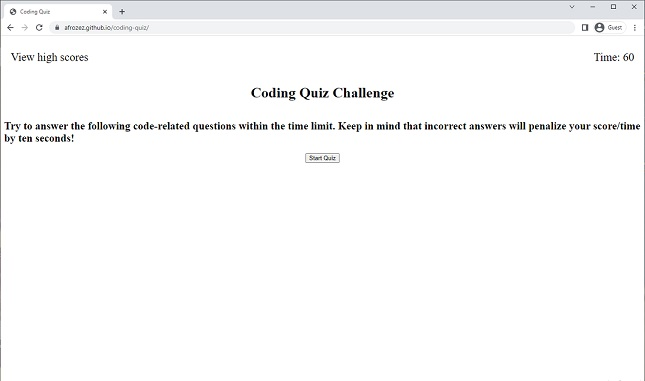

# coding-quiz

Link to deployed application: https://afrozez.github.io/coding-quiz/

## To successfully make a functional quiz I had to research how to make my page dynamic. I also had to look up how to store and retrieve data from the local storage. While creating this I got alot of practice writing code from scratch to make a functional quiz.

    If anyone would like to work on/add to this project it is recommended to first follow these steps:

- Download Visual Studio Code: https://code.visualstudio.com/
- Pull the files frop my GitHub Profile Repository: https://github.com/Afrozez/passwordgenerator-03
- It is recommended to have the latest version of Google Chrome which can be found here: https://www.google.com/chrome/.
  

## Usage
 This (https://afrozez.github.io/coding-quiz/) project displays a web based program that cycles through a array of coding questions. It will deduct 10 seconds for every incorrect answer and ask for the users initials at the end. Once the user enters their initials it will display the previous players scores. You can also view the highscore list by clicking the "View Highscores" text on the top left. This module will also be added to a github to display my experience to future visitors to my github page.

If any users have any questions about how to start the project they can reach me at lukeadenhartog@gmail.com.

## Credits
All of the coding in this github application was created/written by Luke A DenHartog.

## License
N/A

## Copyright (c) 2023 Luke

Permission is hereby granted, free of charge, to any person obtaining a copy of this software and associated documentation files (the "Software"), to deal in the Software without restriction, including without limitation the rights to use, copy, modify, merge, publish, distribute, sublicense, and/or sell copies of the Software, and to permit persons to whom the Software is furnished to do so, subject to the following conditions:

The above copyright notice and this permission notice shall be included in all copies or substantial portions of the Software.

THE SOFTWARE IS PROVIDED "AS IS", WITHOUT WARRANTY OF ANY KIND, EXPRESS OR IMPLIED, INCLUDING BUT NOT LIMITED TO THE WARRANTIES OF MERCHANTABILITY, FITNESS FOR A PARTICULAR PURPOSE AND NONINFRINGEMENT. IN NO EVENT SHALL THE AUTHORS OR COPYRIGHT HOLDERS BE LIABLE FOR ANY CLAIM, DAMAGES OR OTHER LIABILITY, WHETHER IN AN ACTION OF CONTRACT, TORT OR OTHERWISE, ARISING FROM, OUT OF OR IN CONNECTION WITH THE SOFTWARE OR THE USE OR OTHER DEALINGS IN THE SOFTWARE.
